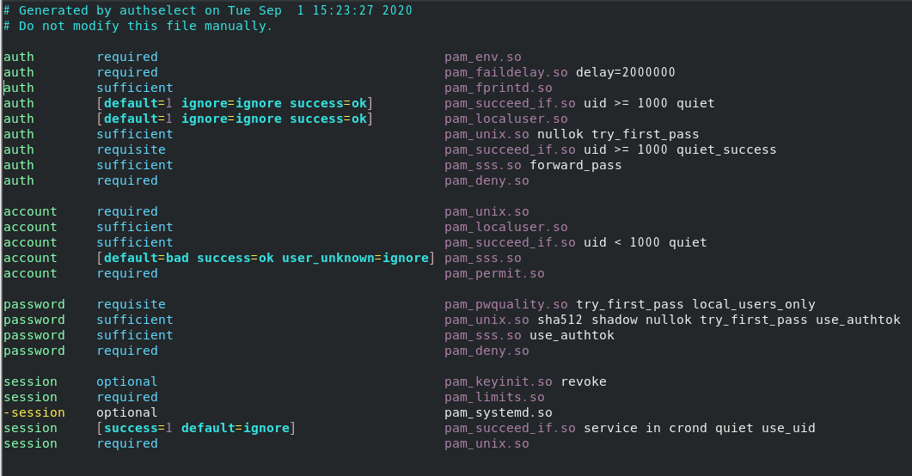

## Linux中PAM模块详解

>   **pam简介** 
>   Linux-PAM(linux可插入认证模块)是一套共享库，使本地系统管理员可以随意选择程序的认证方式。换句话说，不用重新编译一个包含PAM功能的应用程序，就可以改变它使用的认证机制。这种方式下,就算升级本地认证机制,也不用修改程序. PAM使用配置/etc/pam.d/下的文件,来管理对程序的认证方式.应用程序 调用相应的配置文件,从而调用本地的认证模块.模块放置在/lib/security下,以加载动态库的形式进，像我们使用su命令时,系统会提示你输入root用户的密码.这就是su命令通过调用PAM模块实现的。

**PAM的配置文件介绍**

-   写在/etc/pam.conf文件中
-   将PAM配置文件放到/etc/pam.d/目录下 
-   
    -   第一列代表模块类型 
    -   第二列代表控制标记 
    -   第三列代表模块路径 
    -   第四列代表模块参数

**PAM的模块类型** 
Linux-PAM有四种模块类型,分别代表四种不同的任务，它们是:认证管理(auth),账号管理(account),会话管理(session)和密码(password)管理,一个类型可能有多行,它们按顺序依次由PAM模块调用.

管理方式 说明 
auth 用来对用户的身份进行识别.如:提示用户输入密码,或判断用户是否为root等. 
account 对帐号的各项属性进行检查.如:是否允许登录,是否达到最大用户数,或是root用户是否允许在这个终端登录等. 
session 这个模块用来定义用户登录前的,及用户退出后所要进行的操作.如:登录连接信息,用户数据的打开与关闭,挂载文件系统等. 
password 使用用户信息来更新.如:修改用户密码.

**PAM的控制标记** 
PAM使用控制标记来处理和判断各个模块的返回值.（在此只说明简单的认证标记）

控制标记 说明 
required 表示即使某个模块对用户的验证失败，也要等所有的模块都执行完毕后,PAM 才返回错误信息。这样做是为了不让用户知道被哪个模块拒绝。如果对用户验证成功，所有的模块都会返回成功信息。 
requisite 与required相似,但是如果这个模块返回失败,则立刻向应用程序返回失败,表示此类型失败.不再进行同类型后面的操作. 
sufficient 表示如果一个用户通过这个模块的验证，PAM结构就立刻返回验证成功信息（即使前面有模块fail了，也会把 fail结果忽略掉），把控制权交回应用程序。后面的层叠模块即使使用requisite或者required 控制标志，也不再执行。如果验证失败，sufficient 的作用和optional相同。 
optional 表示即使本行指定的模块验证失败，也允许用户接受应用程序提供的服务，一般返回PAM_IGNORE(忽略).

**模块路径** 
模块路径.即要调用模块的位置. 如果是64位系统，一般保存在/lib64/security,如: pam_unix.so同一个模块,可以出现在不同的类型中.它在不同的类型中所执行的操作都不相同.这是由于每个模块针对不同的模块类型,编制了不同的执行函数.