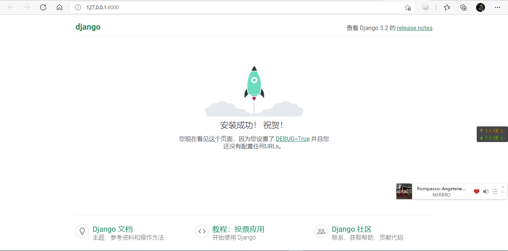

## 创建Django项目


### 前置条件：

创建python项目前需要安装Django

```bash
# 安装Django, 将会安装最新版本的Django
python -m pip install django

# 获取安装指定版本, 例如:Django 3.2
python -m pip install django==3.2
```


### 创建项目：

```bash
# 使用Django项目管理工具django-admin创建基本Django项目, 在Django安装完成后会附带django-admin工具
django-admin startproject "项目名称"

# 例如创建一个项目 mysite
django-admin startproject mysite
```


### 中国本地化配置（可选）

找到项目下的同名目录下的 <u>settings.py</u>，该文件包含了项目的所有配置，修改以下配置

**修改默认语言为简体中文：**

```python
LANGUAGE_CODE = 'zh-hans'
```

**修改时区为中国上海**

```python
TIME_ZONE = 'Asia/Shanghai'
```

**关闭国际化支持：**Django 默认支持国际化，多语言。如果不需要国际化支持，修改以下配置为False，Django会进行一些优化，不加载国际化支持机制。

```python
USE_I18N = False
```

**修改后端数据库存储时间：** `USE_TZ` 选项为 `True` 时，后端数据库存储的是 `UTC` 时间，如果是在国内使用，会比国内实际时间相差8小时，需要设置为 `False`

```python
USE_TZ = False
```


### 执行数据迁移

Django使用ORM来操作底层数据库，在正式使用Django项目前需要将ORM应用到底层数据库中（例如创建数据表）

使用 django-admin 创建的基本Django项目包含了几个默认的DjangoAPP，需要为这些默认的APP迁移数据

可以使用Django项目下的 `manage.py`项目管理脚本来实现迁移

```bash
# 构建 Django APP 构建APP迁移文件
python .\manage.py makemigrations

# 根据迁移文件迁移数据到数据库
python .\manage.py migrate
```

```bash
Operations to perform:
  Apply all migrations: admin, auth, contenttypes, sessions
Running migrations:
  Applying contenttypes.0001_initial... OK
  Applying auth.0001_initial... OK
  Applying admin.0001_initial... OK
  Applying admin.0002_logentry_remove_auto_add... OK
  Applying admin.0003_logentry_add_action_flag_choices... OK
  Applying contenttypes.0002_remove_content_type_name... OK
  Applying auth.0002_alter_permission_name_max_length... OK
  Applying auth.0003_alter_user_email_max_length... OK
  Applying auth.0004_alter_user_username_opts... OK
  Applying auth.0005_alter_user_last_login_null... OK
  Applying auth.0006_require_contenttypes_0002... OK
  Applying auth.0007_alter_validators_add_error_messages... OK
  Applying auth.0008_alter_user_username_max_length... OK
  Applying auth.0009_alter_user_last_name_max_length... OK
  Applying auth.0010_alter_group_name_max_length... OK
  Applying auth.0011_update_proxy_permissions... OK
  Applying auth.0012_alter_user_first_name_max_length... OK
  Applying sessions.0001_initial... OK
```


### 测试项目

```bash
# 开启python项目
python .\manage.py runserver
```

如果呈现默认欢迎页面则表示项目创建成功



