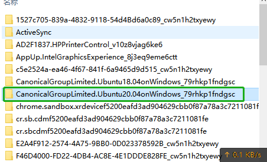
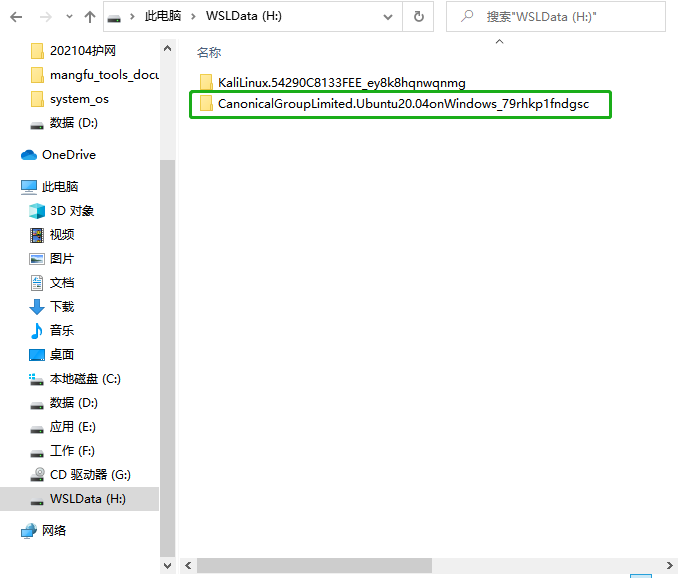
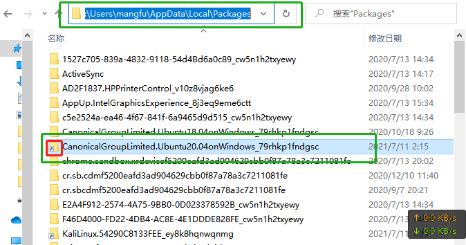
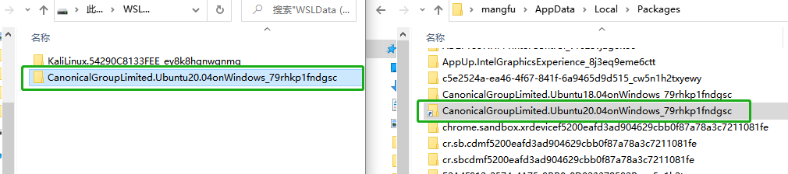

# 从C盘迁移Linux子系统到其他路径


#### 问题：

运行时间久了或者安装的linux子系统多了会占用大量的C盘空间，所以需要将其从C盘迁移到其他盘中


#### 解决方案：

WSL2中的Linux子系统本质上是一个 Hype-V 虚拟机，所以只需要找到对应虚拟机的数据目录，迁移到其他盘然后在原位置建立一个目录连接就可以了


#### 实施：

##### 1、关闭Linux子系统

在迁移之前需要关闭正在运行的Linux子系统

```powershell
wsl --shutdown
```


##### 2、找到对应的Linux子系统的存储目录

WSL的Linux子系统默认是存储在 <u>C:\Users\用户文件夹\AppData\Local\Packages</u> 中的，在此目录中找到对应的Linux子系统目录，例如在本例中要迁移的Linux子系统为 Ubuntu20.04，对应的Linux子系统数据目录为：

<u>C:\Users\mangfu\AppData\Local\Packages\CanonicalGroupLimited.Ubuntu20.04onWindows_79rhkp1fndgsc</u>




##### 3、迁移数据目录

找到对应的数据目录后，将整个目录移动到需要其他路径（在本例中是单独划分了一个H盘来存放Linux子系统数据）




##### 4、创建目录连接（关键步骤）

移动子系统的数据目录后，需要使用 `mklink /J` 命令将目录链接到原来的位置，以下是本例使用的命令：

>   mklink /J 链接路径 需要被链接的目录的路径

```powershell
mklink /J "C:\Users\mangfu\AppData\Local\Packages\CanonicalGroupLimited.Ubuntu20.04onWindows_79rhkp1fndgsc" "H:\CanonicalGroupLimited.Ubuntu20.04onWindows_79rhkp1fndgsc"
```


mklink命令使用方法可参考以下（或者直接在cmd中输入mklink查看）：

```powershell
C:\Users\mangfu>mklink
创建符号链接。

MKLINK [[/D] | [/H] | [/J]] Link Target

        /D      创建目录符号链接。默认为文件
                符号链接。
        /H      创建硬链接而非符号链接。
        /J      创建目录联接。
        Link    指定新的符号链接名称。
        Target  指定新链接引用的路径
                (相对或绝对)。
```


##### 5、验证

迁移完成后，尝试开启Linux子系统，本例中开启的是 Ubuntu20.04，

```powershell
wsl -d Ubuntu-20.04
```

如果可以正常进入即迁移成功：

```powershell
PS C:\Users\mangfu> wsl -d Ubuntu-20.04
mf@DESKTOP-8RER1H0:/mnt/c/Users/mangfu$
```


如果不清楚子系统的名称，可以使用以下命令查看

```powershell
wsl -l
```

输出：

```powershell
PS C:\Users\mangfu> wsl -l
适用于 Linux 的 Windows 子系统分发版:
Ubuntu-20.04 (默认)
kali-linux
```


##### 6、失败处理

如果不能正常开启子系统

1.  检查目录链接是否创建成功，创建成功的话会在默认的存储目录下显示一个目录链接

    

2.  如果目录链接创建成功，检查链接的名称与原来的子系统数据目录名称是否一致，如果不一致，删除链接并重新使用 mklink 命令创建

    

3.  如果以上两个问题都没遇到建议将子系统目录移动回默认位置

